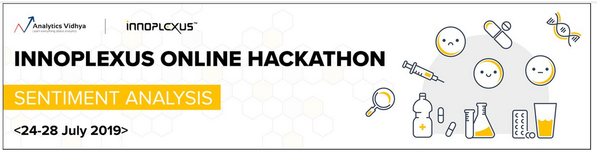
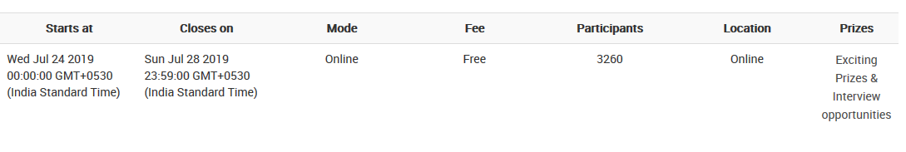

# Innoplexus Online Hackathon - Sentiment Analysis

# Objective
To predict the sentiment of a drug usage from the customer feedback 

# train.csv

Variable	          | Definition
--------------------|---------------------------------------------------
unique_hash         | Unique impression id                     
text	              | customer feedback
drug	              | Name of the drug
Sentiment           | (target) measured in 0,1 or 2

# test.csv

Variable	          | Definition
--------------------|---------------------------------------------------
unique_hash         | Unique impression id                     
text	              | customer feedback
drug	              | Name of the drug

# submission.csv

Variable	          | Definition
--------------------|---------------------------------------------------
unique_hash         | Unique impression id                     
Sentiment           | (target) measured in 0,1 or 2

# Leadership Board

Within 15% of the total participants
